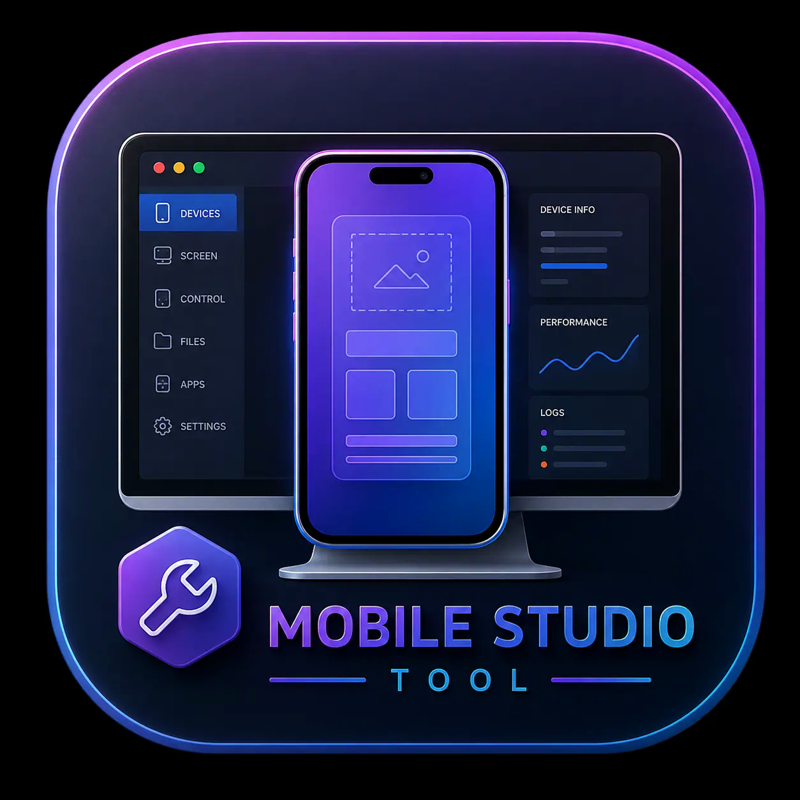
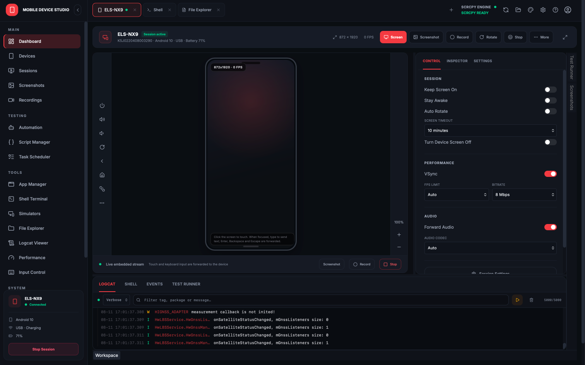

<p align="center">
  
  <br>
  <h1>ScrcpyGUI Plus</h1>
  <strong>A premium, high-performance Android control experience.</strong>
</p>

<p align="center">
  
</p>


---

ScrcpyGUI v4 is a modern, feature-rich GUI for [scrcpy](https://github.com/Genymobile/scrcpy), completely rebuilt from the ground up using **Tauri v2**, **React 19**, and **Rust**. It transforms your Android device into a professional tool for gaming, development, and content creation.

## 🚀 Key Features

- **✨ Best Looking GUI**: A stunning, modern interface with smooth animations and a premium look and feel.
- **🎨 Custom Theme Engine**: 5 premium, hand-crafted themes including **Ultraviolet**, **Astro**, **Carbon**, **Emerald**, and **Bloodmoon** to match your workspace setup.
- **🔄 Automated Binary Updates**: Deep-integrated system that automatically checks if your local `scrcpy` binary is outdated compared to Genymobile's latest official release, prompting you with a beautiful one-click update modal.
- **🎮 Precision Input (OTG)**:
  - **HID Keyboard**: Native hardware simulation for international layouts and special characters.
  - **HID Mouse**: Zero-lag, high-precision cursor control for a "native desktop" feel.
- **🖥️ Graphics Renderer Selection**:
  - Choose a renderer backend such as Direct3D, OpenGL, OpenGL ES, Metal, or Software (capability-aware, OS-filtered).
- **🌐 Seamless Connectivity**:
  - **Wireless Pairing**: Native UI for Android 11+ wireless pairings.
  - **Connection History**: Remember and reconnect to wireless devices with one click.
- **📹 Pro Camera Mode (Webcam)**:
  - **Refresh Lenses**: Click to automatically scan and list all physical camera sensors, resolutions, and zoom ranges.
  - **Torch & Zoom**: Toggle your device's flashlight or adjust zoom level (1.0x - 5.0x) natively.
  - **Failsafe Camera-Size**: Automatically maps resolutions and defaults to safe 1080p dimensions, preventing hardware encoder crashes on high-megapixel devices.
- **🖥️ Desktop Mode (Virtual Display)**:
  - **Flex Display**: Drag and resize your virtual desktop window dynamically on the fly!
  - **Background Colors**: Customize scrcpy's border and letterbox color with hex values and a live color swatch.
  - **Keep Active**: Periodic user activity simulator preventing device sleep without changing global settings.
- **📁 Fluid File Management**:
  - Drag & drop APK installation or file pushing directly to `/sdcard/Download/`.
- **🖼️ Premium UX**:
  - **Splash Screen**: Zero-flicker, themed startup experience.
  - **Smart Folder Picker**: Automatically falls back to local `scrcpy-bin` or application executable directories when browsing folders.

---

## 📖 Getting Started

To learn how to enable **USB Debugging**, set up **Wireless Pairing**, or install requirements, please read our comprehensive guide:

### 👉 **[View the Complete User Guide (GUIDE.md)](GUIDE.md)**

---

## 🛠️ Development

### Prerequisites
- [Node.js](https://nodejs.org/) (v18+)
- [Rust](https://rust-lang.org/) & Cargo
- [Tauri v2 Prerequisites](https://v2.tauri.app/start/prerequisites/)

### Build Instructions
1. `npm install`
2. `npm run tauri dev` (Development)
3. `npm run tauri build` (Production)

### Windows portable build

Run the following command from Windows PowerShell:

```powershell
npm run build:portable:windows
```

The generated ZIP is written to
`src-tauri/target/release/bundle/portable/`. It contains the application,
the tested scrcpy release, and ADB, so it can be extracted and run without an
installer. Microsoft Edge WebView2 Runtime is still required.

### Robot Framework mobile tests

Flows recorded in **Automation** can be exported as keyword-driven `.robot`
suites. The generated suite uses AppiumLibrary and includes reusable keywords
for taps, ADB commands, foreground-package assertions, screenshots, and video.

Run an exported suite after starting Appium:

```bash
pip install robotframework robotframework-appiumlibrary
robot --variable DEVICE_NAME:YOUR_ADB_SERIAL path/to/exported.robot
```

### Run Maestro tests inside the app

Open **Script Manager → Maestro Test**, select an Android device, and run a
`.yaml` flow. The panel can materialize the bundled, non-transactional
WashXpress smoke test or open another local Maestro flow. Pass/fail output is
shown in the app and saved to Test Runs. Maestro CLI must be installed on the
desktop running ScrcpyGUI. The visual Action Builder supports launch/resume,
tap by text or resource ID, text input, visible assertions, element waits,
animation waits, Android keys, screenshots, reordering, and deletion.
Its categorized catalog mirrors all commands in Maestro's official command
reference; advanced commands are inserted as editable YAML templates.

## ❄️ NixOS Installation (flakes)

To install it permanently with a desktop launcher, add the flake to your system's `flake.nix`:

```nix
inputs.scrcpy-gui-plus.url = "github:kil0bit-kb/scrcpy-gui-plus";
```

Then add it to your system packages:

```nix
environment.systemPackages = [
  inputs.scrcpy-gui-plus.packages.${pkgs.system}.default
];
```
---
<!--
## 💖 Support the Project

If ScrcpyGUI helps you in your daily workflow, you can support its independent development on Patreon. Your support helps maintain the app and fund future improvements.

<p align="left">
  <a href="https://www.patreon.com/cw/KB_kilObit">
    
  </a>
</p>-->

---

## 🔗 Original Project

This project is based on the original [ScrcpyGUI project](https://github.com/kil0bit-kb/scrcpy-gui). Please visit the original repository for its project history and upstream documentation.

---

## 🙏 Acknowledgments

We are grateful to the open-source projects that make this app possible. ScrcpyGUI Plus is an independent project and is not affiliated with Genymobile or the scrcpy authors.

- **[ScrcpyGUI upstream](https://github.com/kil0bit-kb/scrcpy-gui)**: The original ScrcpyGUI v4 project this project is based on.
- **[scrcpy](https://github.com/Genymobile/scrcpy)**: The Android display and control engine created and maintained by Genymobile.
- **[Tauri](https://tauri.app/)**: The secure, lightweight framework for the desktop app.
- **[Lucide Icons](https://lucide.dev/)**: For the clean and consistent iconography.
- **[React](https://react.dev/)**: Powering the modern, interactive interface.

---

## 📜 License

This project is licensed under the MIT License - see the [LICENSE](LICENSE) file for details.
